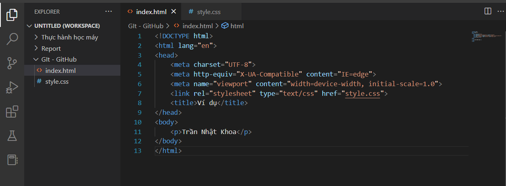
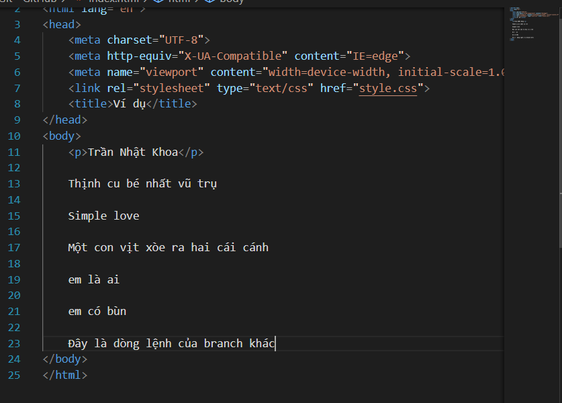

# **Report Git và Github - Report Seminar 10/2/2023**

## **Mục lục**

I. *Giới thiệu về Git và Github*

II. *Các câu lệnh cơ bản của Git và Github*

III. *Demo Git*

---

## **I. Giới thiệu về Git và Github**
1. Git là một phần mềm quản lý mã nguồn phân tán do Linux phát triển được sử dụng rộng rãi cho các dự án phát triển phần mềm. Nó cho phép nhiều nhà 
phát triển cùng làm việc trên mã nguồn cùng một lúc và giữ lại lịch sử của tất cả các thay đổi.
    
    

    Hiểu đơn giản git giúp bạn có thể quản lý dự án một cách dễ dàng, tường mình và theo dõi công việc hiệu quả.
    
2. Github là một nền tảng lưu trữ mã nguồn được sử dụng rộng rãi trong lập trình. Nó cho phép nhóm lập trình viên cùng làm việc với nhau và chia sẻ mã nguồn của họ với mọi người trên toàn thế giới.

    

    Github có thể kết hợp cùng với git giúp cho bạn quản lý dự án được hiểu quả hơn, ngoài ra Github cũng có thể xem như một mạng xã hội để mọi người có thể giao lưu và cùng nhau trao đổi.

---

## **II. Một số lệnh cơ bản với Git và Github**
Phần này mình sẽ giới thiệu sơ lược về các lệnh của cơ bản với Git và Github , qua phần sau mình sẽ demo rõ hơn về cách thức mà nó hoạt động.
1. **git init**: Tạo một repository mới trong thư mục hiện tại.

2. **git clone** <repository>: Sao chép một repository từ máy chủ xuống máy cục bộ.

3. **git add** <**file**>: Thêm một file hoặc nhiều file vào stage area để chuẩn bị cho commit.

4. **git commit -m "message"**: Tạo một commit mới với nội dung trong dấu ngoặc kép.

5. **git status**: Xem trạng thái hiện tại của repository, bao gồm các file đã thay đổi nhưng chưa được thêm vào stage area hoặc đã được stage nhưng chưa được commit.

6. **git log**: Xem lịch sử các commit trong repository.

7. **git branch**: Xem danh sách các nhánh của repository.

8. **git branch** <**branch-name**>: Tạo một nhánh mới với tên cho trước.

9. **git checkout** <**branch-name**>: Chuyển đến một nhánh khác.

10. **git merge** <**branch-name**>: Hợp nhất nhánh cho trước với nhánh đang được checkout.

11. **git remote add origin** <**url của repository trên Github**>: Tạo mới một repository trên Github:

12. **git push origin** <**branch-name**>: Push các commit lên Github

13. **git pull origin** <**branch-name**>: Tải về các thay đổi mới nhất từ Github

---

## **III. Demo Git**

Bạn có thể kiểm tra xem máy bạn đã được cài đặt git hay chưa bằng câu lệnh **git version**, nếu nó không trả về phiên bản của git thì bạn cần download nó ở [link trang chủ của git](https://git-scm.com/).

Đây là hai file mình đã tạo ở trong thư mục, hãy cùng xem qua trạng thái ban đầu của nó:

Đầu tiên để tạo một **repo** trên máy của bạn, bạn có thể trỏ tới thư mục bằng lệnh cd mình đang làm việc hay nếu đó đang ở thư mục đó rồi thì hãy sử dụng câu lệnh git init và nó sẽ trả về cho bạn kết quả như hình sau để thông báo repo đã được tạo trên máy của bạn:

Tiếp theo ta sẽ xem trạng thái hiện tại của repo, tất nhiên là sẽ chưa có file nào đang trong mục staging để chờ commit:

Đến đây khi bạn muốn lưu lại trạng thái mình đã làm trước tiên ta sẽ dùng lệnh **git add** để chuyển một file bình thường vào trong staging area (nơi chờ để commit), sau đó dùng lệnh **git commit -m "message"** để lưu trạng thái:

Sau đó chúng ta hãy thử thay đổi một vài thứ trong file **index.html** để xem thử điều gì xảy ra:

Như đã thấy chúng ta dễ dàng biết được những dòng code bị thay đổi. Hãy tiếp tục làm lại bước trên và xem sự thay đổi một lần nữa:

Tổng kết lại ta đã có 2 lần commit, dễ thấy ta có thể xem và so sánh code của lần vừa commit với code đang làm. Vậy làm sao để ta biết được code của những lần commit khác trong quá khứ? Ta sẽ dùng lệnh **git log** để xem lại lịch sử(bao gồm thông tin người đã commit, thời gian,...) các lần commit từ gần nhất đến xa nhất 

Và ta sẽ thử xem lại code của lần đầu tiên commit bằng lệnh **git checkout** <**commit-hash**> (truyền vào mã băm của lần commit đó), khi đó file chính **index.html** sẽ quay trở về trạng thái lần đầu tiên đã commit :

## **III. Demo Git với Github**

Đầu tiên hãy thử tạo git repo trên github, sau khi tạo xong một repo trên git và muốn kết nối repo trên máy của bạn với repo vừa tạo thì ta sẽ làm theo chỉ dẫn của Github:
 

Ta cũng có thể xem lại chi tiết các lần commit ở trên đó, tiếp theo ta sẽ đi đến **branch**, có thể hiểu nôm na là thay ta sẽ rẽ dự án đang phát triển qua một nhánh khác, những thao tác như commit, ... ở trên nhánh này sẽ không ảnh hưởng đến các nhánh khác.

Dùng lệnh **git branch** <**branch-name**> để tạo branch mới dựa trên nhánh chính, sao đó hãy thử commit và push code lên github, khi đó những commit đã có ở nhánh chính cũng sẽ xuất hiện ở nhánh này:

Và nó đã xuất hiện trên Github với các commit cũ của nhánh đầu tiên.

---